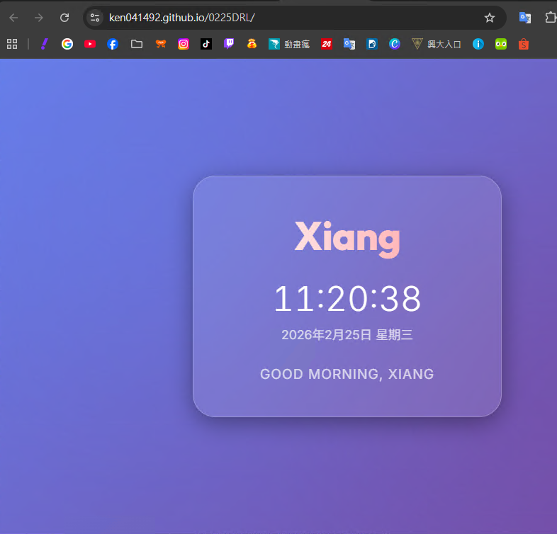

# Xiang's Personal Web Page

A modern, single-page web application featuring a glassmorphic design, a real-time clock, and personalized greetings.

## 🚀 [Demo](https://ken041492.github.io/0225DRL/)

## 🛠️ Features

- **Glassmorphism Design**: Frosted glass effects and vibrant animated gradients.
- **Dynamic Clock**: Updates every second with the current local time and date.
- **Personalized Greeting**: Changes based on the time of day (Morning/Afternoon/Evening).
- **Responsive**: Fully optimized for mobile and desktop viewing.

## 📁 Project Structure

- `index.html`: Structural markup.
- `style.css`: Styling and animations.
- `script.js`: Time and greeting logic.

## 📝 Activity Summary

For a detailed log of today's development activities, see [summary.md](summary.md).
